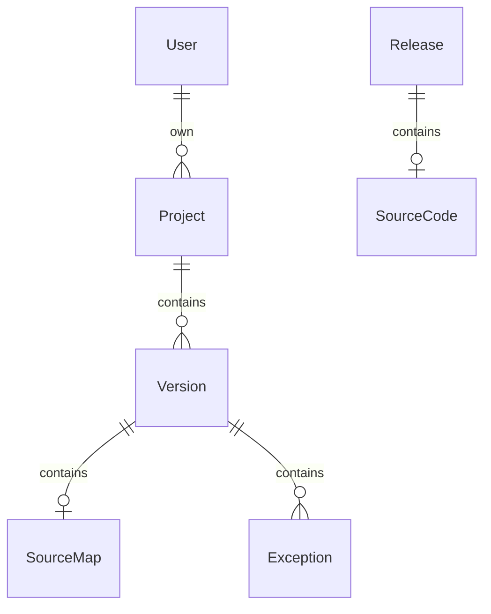

# Meerkat

Meerkat（狐獴）是一个前端应用异常监控服务，主要用于收集用户使用过程中发生的各种异常，帮助开发人员快速定位问题。

##功能概述

* 捕获浏览器、前端框架抛出的异常和警告
* 监控后台用户管理，登录，注册
* 项目管理
* 源码版本管理
* 通过`sourcemap` 定位源码异常位置
* 异常统计

## 详细设计

### 模型关系图

**Exception**

Exception 类型：

### 数据库设计

**User**

| field | type | remark |
| -------- | --------------------------- | ---- |
| id       | string                      |      |
| name     | string                      |      |
| password | string                      |      |
| role     | superAdmin，projectMananger |      |
| nickname |                             |      |

**Project**
| field | type | remark |
| -------- | --------------------------- | ---- |
| id       |                             |      |
| name     |                             |      |
| remark |                             |      |

**Version**
| field | type | remark |
| ---- | ---- | ---- |
| id |      |      |
| name |      |      |
| remark |      |      |

**Exception**
| field | type | remark |
| ---- | ---- | ---- |
| id |      |      |
| projectId |      |      |
| versionId |      |      |
| browser |      |      |
| os |      |      |
| url |      |      |
| browser |      |      |